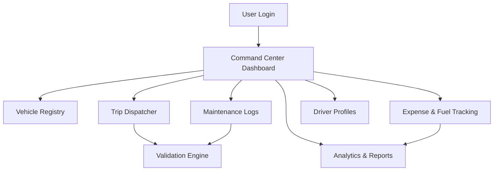

## Deploy: 
https://tinyurl.com/fleetlogistic


# FleetFlow – Intelligent Fleet Lifecycle & Safety Management System  

### Replace Manual Logbooks with a Smart, Rule-Based Digital Fleet Hub

> A centralized platform designed to optimize fleet lifecycle management, enhance driver safety compliance, and deliver real-time financial insights.

---


---

# Project Overview

**FleetOps** is a comprehensive fleet management system built to eliminate inefficient, manual record-keeping and replace it with an intelligent, rule-driven digital command center.

This system enables:

- Real-time fleet visibility  
- Driver compliance enforcement  
- Automated dispatch validation  
- Preventative maintenance tracking  
- Fuel & expense analytics  
- Operational ROI reporting  

---

# Objective

To replace outdated manual logbooks with a centralized, rule-based digital hub that:

- Optimizes the entire delivery fleet lifecycle  
- Monitors driver compliance and safety  
- Tracks operational and financial performance  
- Improves decision-making through analytics  

---

# Target Users

| Role | Responsibilities |
|------|------------------|
| **Fleet Managers** | Oversee vehicle lifecycle, maintenance, utilization |
| **Dispatchers** | Assign trips, validate loads, manage logistics |
| **Safety Officers** | Track license validity, compliance, safety scores |
| **Financial Analysts** | Monitor fuel spend, maintenance ROI, cost-per-km |

---

# System Architecture Overview



---

# Core System Pages

---

## Page 1: Login & Authentication

**Purpose:** Secure access based on user roles.

**Features:**

- Email / Password authentication  
- Forgot Password recovery  
- Role-Based Access Control (RBAC)  
- Manager vs Dispatcher vs Analyst permissions  

---

## Page 2: Command Center (Main Dashboard)

**Purpose:** High-level fleet oversight.

### KPIs:

- **Active Fleet** – Vehicles currently “On Trip”  
- **Maintenance Alerts** – Vehicles marked “In Shop”  
- **Utilization Rate** – % Assigned vs Idle  
- **Pending Cargo** – Unassigned shipments  

### Filters:

- Vehicle Type (Truck / Van / Bike)  
- Status  
- Region  

---

## Page 3: Vehicle Registry (Asset Management)

**Purpose:** CRUD management of fleet assets.

### Data Points:

- Name / Model  
- License Plate (Unique ID)  
- Max Load Capacity (kg / tons)  
- Odometer Reading  
- Status Toggle: Available / On Trip / In Shop / Retired  

### System Logic:

- Manual toggle for “Out of Service”  
- Vehicles in "In Shop" state automatically removed from dispatch selection  

---

## Page 4: Trip Dispatcher & Management

**Purpose:** Manage delivery workflow from origin to destination.

### Features:

- Trip Creation Form  
- Assign Available Vehicle + Available Driver  
- Cargo Weight Validation  

### Validation Rule:

```
IF CargoWeight > MaxCapacity
THEN Trip Creation = Blocked
```

### Lifecycle:

Draft → Dispatched → Completed → Cancelled  

---

## Page 5: Maintenance & Service Logs

**Purpose:** Preventative and reactive maintenance tracking.

### Automation Logic:

- Adding vehicle to Service Log → Status automatically switches to **In Shop**
- Vehicle hidden from Dispatcher pool  
- On completion → Status reverts to Available  

---

## Page 6: Completed Trip, Expense & Fuel Logging

**Purpose:** Financial visibility per asset.

### Features:

- Log Fuel (Liters, Cost, Date)  
- Log Maintenance Expenses  
- Odometer Tracking  

### Automated Calculation:

**Total Operational Cost per Vehicle = Fuel + Maintenance**

---

## Page 7: Driver Performance & Safety Profiles

**Purpose:** Compliance and HR management.

### Compliance Rules:

- License expiry tracking  
- Assignment blocked if license expired  
- Vehicle category validation (e.g., Van license required for Van)  

### Performance Metrics:

- Trip Completion Rate  
- Safety Score  
- On-Time Delivery Rate  

### Driver Status:

On Duty / Off Duty / Suspended  

---

## Page 8: Operational Analytics & Financial Reports

**Purpose:** Data-driven decision making.

### Key Metrics:

**Fuel Efficiency:**

```
km per Liter (km/L)
```

**Vehicle ROI:**

```
(Revenue - (Maintenance + Fuel)) / Acquisition Cost
```

### Reporting:

- Monthly Payroll Reports  
- Fleet Health Audit Reports  
- One-click CSV Export  
- One-click PDF Export  

---

# Logic & Workflow Summary

### Vehicle Intake

Add **Van-05**  
Capacity: 500kg  
Status: Available  

---

### Driver Compliance

Add Driver "Alex"  
System verifies license validity for Van category  

---

### Dispatching

Assign Alex → Van-05 → 450kg cargo  

Validation Check:

```
450 < 500 → PASS
```

Status Update:
- Vehicle → On Trip  
- Driver → On Trip  

---

### Trip Completion

Driver marks trip "Completed"  
Final Odometer entered  

Status Update:
- Vehicle → Available  
- Driver → Available  

---

### Maintenance Logging

Manager logs “Oil Change”  

Auto Logic:
- Status → In Shop  
- Hidden from Dispatcher  

---

### Analytics Update

System recalculates:

- Cost per km  
- Total operational cost  
- ROI metrics  

---

# Suggested Project Structure

```
fleetops/
│
├── auth/                   # Authentication & RBAC
├── dashboard/              # Command Center KPIs
├── vehicles/               # Vehicle CRUD
├── dispatch/               # Trip lifecycle management
├── maintenance/            # Service logs
├── expenses/               # Fuel & operational cost tracking
├── drivers/                # Driver profiles & compliance
├── analytics/              # Reporting engine
│
├── database/               # Relational schema
└── README.md
```

---

# Technical Requirements

## Frontend

- Modular UI components  
- Scannable data tables  
- Status pills (Available / On Trip / In Shop)  
- Role-based visibility  

## Backend

- Real-time state management  
- Rule-based validation engine  
- Status synchronization between vehicles and drivers  

## Database

Relational structure:

- Vehicles  
- Drivers  
- Trips  
- Expenses  
- Maintenance Logs  

All expenses and trips must reference a specific Vehicle ID.

---

# Key Features

✔ Rule-Based Dispatch Validation  
✔ Real-Time Fleet Availability  
✔ Automated Compliance Enforcement  
✔ Preventative Maintenance Tracking  
✔ Fuel & Expense Monitoring  
✔ ROI & Cost-Per-KM Calculations  
✔ CSV & PDF Reporting  
✔ Scalable, Modular Architecture  

---

# Future Enhancements

- GPS Live Tracking Integration  
- Predictive Maintenance (AI-based)  
- Driver Behavior Telematics  
- Mobile App for Drivers  
- Automated Alerts & Notifications  
- Multi-Branch Fleet Support  
- API Integration with Accounting Systems  

---

# Use Cases

- Logistics & Delivery Companies  
- E-commerce Fleet Operations  
- Third-Party Distribution Networks  
- Corporate Transport Departments  
- Fleet Leasing Businesses  

---

# Contributing

1. Fork repository  
2. Create feature branch  
3. Commit changes  
4. Push branch  
5. Open Pull Request  

---

# Final Note

FleetOps is not just a tracking tool — it is a **decision intelligence system** for modern fleet operations.

Built for scalability.  
Designed for compliance.  
Optimized for profitability. 
